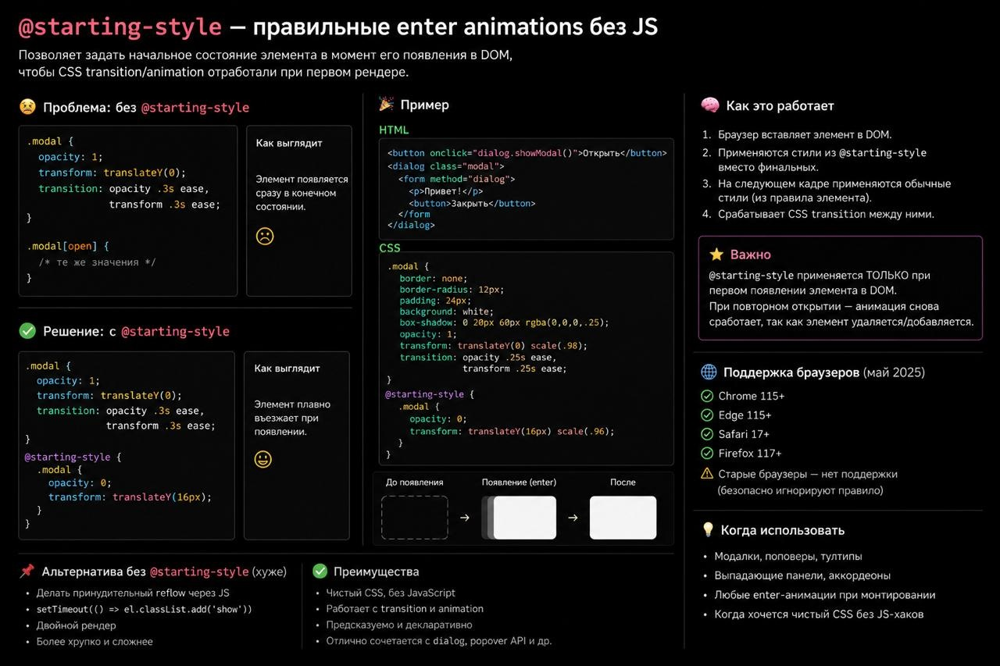

# Содержание

1. [content-visibility](#content-visibility)
2. [clamp](#clamp)
3. [minmax()](#minmax)
4. [Смена темы](#switchTheme)
5. [CSS Scroll Snap](#scrollSnap)
6. [Псевдоклассы :not() и :has()](#псевдоклассы-not-и-has)
7. [CSS в 2025 (:is, :where, :layer)](#css-в-2025)
8. [Logical properties в CSS](#logical-properties-в-css)
9. [Что такое @property](#что-такое-property)
10. [Что такое @starting-style?](#что-такое-starting-style)

---

# content-visibility

- CSS свойство `content-visibility` откладывает рендеринг элемента,  
  включая компоновку и отрисовку, до тех пор, пока он не понадобится (не просто откладывает операции отрисовки — он полностью пропускает вычисления макета.
- Без `content-visibility` браузеры послушно отображают каждый пиксель,
  независимо от того, видите его или нет. Это, как в ресторане —
  готовят каждое блюдо в меню на случай, если кто-то его закажет.

- CSS свойство `content-visibility` лучше всего работает на страницах с
  большим количеством сложного, вынесенного за пределы первого экрана
  контента. Новостные ленты, списки товаров и сайты документации —
  идеальные кандидаты.

  .my-section {
  content-visibility: auto;
  contain-intrinsic-size: 0 500px;
  }

- CSS свойство `contain-intrinsic-size` — сообщник `content-visibility`
  в преступлении. Оно предоставляет оценку размера, чтобы браузер мог
  зарезервировать место перед рендерингом, предотвращая смещение
  макета.
- Однако `content-visibility` — это не бесплатная магия. Каждый элемент
  с `content-visibility: auto` становится отдельным содержащим блоком.
  Это может повлиять на позиционирование и привязку к прокрутке.

Экспериментируя с `content-visibility` в различных сценариях, я пришёл к выводу, что лучше всего он работает, когда:

1.  Разделы чётко определены и независимы
2.  Контент ниже первого экрана — сложный
3.  Пользователям, не нужен немедленный доступ к скрытому контенту.

<hr/>

# clamp

---

**clamp()** — это функция в CSS, которая задаёт значение с ограничениями: минимальное, предпочтительное и максимальное. Она позволяет адаптивно управлять размерами элементов или текстом, сохраняя их в заданных пределах.

➡️ Пример:

```js
<div class="text">
  Адаптивный размер текста
</div>

<style>
  .text {
    font-size: clamp(1rem, 2.5vw, 2rem); /* Минимум 1rem, максимум 2rem, предпочтение — 2.5% ширины окна */
    text-align: center;
  }
</style>
```

🗣️ В этом примере текстовый блок изменяет размер шрифта в зависимости от ширины окна, оставаясь в пределах от 1rem до 2rem. Функция clamp() упрощает создание адаптивного дизайна без сложных медиа-запросов.
Подробнее [тут](https://developer.mozilla.org/en-US/docs/Web/CSS/clamp)

<hr/>

# minmax

**minmax()** — это функция в CSS, которая используется в CSS Grid для задания диапазона размеров колонок и строк. Она позволяет установить минимальное и максимальное значение для элементов, обеспечивая адаптивность макета.

➡️ Пример:

```js
<div class="grid">
  <div>Элемент 1</div>
  <div>Элемент 2</div>
  <div>Элемент 3</div>
</div>

<style>
  .grid {
    display: grid;
    grid-template-columns: repeat(3, minmax(100px, 1fr)); /* Колонки от 100px до равномерного распределения */
    gap: 10px;
  }

  .grid div {
    background-color: lightblue;
    padding: 20px;
    text-align: center;
  }
</style>
```

🗣️ minmax(100px, 1fr) гарантирует, что каждая колонка будет не меньше 100px, но при этом адаптивно расширяться в пределах 1fr.

Подробнее [тут](https://developer.mozilla.org/en-US/docs/Web/CSS/minmax)

<hr/>

# <a id="switchTheme"></a>Смена темы

**CSS Custom Properties** — они позволяют динамически менять стили, и к тому же очень легко интегрируются в уже существующие решения.

➡️ Пример:

```html
<button onclick="document.body.classList.toggle('dark-theme')">Toggle Theme</button>
```

```css
:root {
	--primary-color: #3498db;
	--secondary-color: #2ecc71;
}

body {
	background-color: var(--primary-color);
	color: white;
}

button {
	background-color: var(--secondary-color);
	border: none;
	color: white;
	padding: 10px 20px;
}

.dark-theme {
	--primary-color: #2c3e50;
	--secondary-color: #8e44ad;
}
```

<hr/>

# <a id="scrollSnap"></a>CSS Scroll Snap

**CSS Scroll Snap** — контролируемая прокрутка для улучшенного UX

➡️ Пример:

```css
.container {
	display: grid;
	grid-template-columns: repeat(3, 100%);
	scroll-snap-type: x mandatory;
	overflow-x: auto;
}

.item {
	scroll-snap-align: start;
	width: 100%;
}
```

- **scroll-snap-type** — задаём, как будет вести себя прокрутка. В данном случае по горизонтали, и «привязка» к элементам обязательная. То есть ты прокручиваешь — и следующий элемент буквально «прилипает» к экрану.
- **scroll-snap-align** на каждом элементе говорит браузеру, где должен быть тот или иной элемент. В примере это старт (то есть начало элемента), но можно выбрать другие варианты для разных случаев.
- **overflow-x: auto** — чтобы всё это заработало по горизонтали, даём контейнеру возможность прокручиваться.
<hr/>

## Псевдоклассы :not() и :has()

**:not()** позволяет комбинировать несколько условий. Код применяет стиль ко всем img без атрибута class и не являющихся первыми детьми в родительском элементе. Это возможно благодаря тому, что :not() принимает несколько селекторов, разделённых запятыми.

```css
/* Базовое применение */
.link:not(:last-child) {
	margin-left: 1rem;
}

/* Применение для всех img, кроме тех, у которых есть атрибут class */
img:not([class], :first-child) {
	margin-block-start: var(--ds-typography-img-margin-block-start, var(--_ds-typography-main-margin));
}
```

**Комбинация :not() и :has()**

```html
<body>
	<h1>Париж</h1>
	<p>Столица и крупнейший город Франции...</p>
	<h2>История</h2>
	<p>Париж вырос на месте поселения...</p>
	<p>Поселение располагалось на безопасном острове...</p>
</body>
```

```css
/* Применяем стиль только к параграфам, за которыми не следует элемент h2 */
p:not(:has(+ h2)) {
	background-color: lightblue;
}
```

<hr/>

## CSS в 2025

Три ключевых фичи, которые меняют подход к организации стилей, — это **:where()**, **:is()** и **@layer**. Они не просто делают код компактнее, но и помогают избежать проблем с каскадом, специфичностью и масштабированием.

✅ О каждом поподробнее:

• **:is()** — компактный и эффективный селектор.

Селектор :is() позволяет сократить количество строк кода, уменьшить дублирование и сделать код более читаемым, при этом он поддерживается повсеместно.

• **:where()** — стратегический селектор с нулевой специфичностью.

Настоящий помощник в глобальных стилях для дизайн-систем. У него нулевая специфичность, так что он не мешает более точным стилям. Это значит, что можно легко управлять оформлением компонентов и не бояться случайных изменений.

• **@layer** — контроль над каскадом и приоритетами

Крутая штука, которая даёт полный контроль над стилями и их приоритетами. С ним легче поддерживать код и меньше нужно использовать !important. Всё благодаря тому, что можно явно задавать слои каскада, что делает порядок подключения файлов более понятным и структурированным.

• **Как это работает вместе?**

Комбинация **@layer** для настройки уровней важности стилей, **:where()** для безопасного повышения специфичности и **:is()** для упрощения селекторов помогает сделать код более управляемым и масштабируемым. Так вы избегаете неожиданных конфликтов и перегрузок специфичности и легко добавляете новые стили даже в больших проектах.

[Пример реализации is](https://doka.guide/css/is/).
[Пример реализации where](https://doka.guide/css/where/).

```css
Пример применения:

/* :is() — компактный и эффективный селектор */
:is(button, a, input).primary:hover {
	color: white;
}

/* :where() — стратегический селектор с нулевой специфичностью */
:where(.card .title) {
	margin-block: 8px;
}

/* @layer — контроль над каскадом и приоритетами */
@layer reset, base, components, utilities;

@layer reset {
	*,
	*::before,
	*::after {
		margin: 0;
		padding: 0;
	}
}

@layer components {
	.button {
		padding: 8px 12px;
	}
}

@layer utilities {
	.mt-2 {
		margin-top: 8px;
	}
}
```

<hr/>

## Logical properties в CSS

Мы привыкли думать об отступах сверху, справа, снизу и слева. Однако в мире, где направление текста может меняться, такой подход становится всё более ограниченным. На помощь приходят **logical properties**. Они позволяют описывать отступы и размеры в зависимости от потока текста, а не от сторон.

```css
/* Старый способ */
.card {
	padding-top: 12px;
	padding-left: 16px;
}

/* С логическими свойствами */
.card {
	padding-block-start: 12px;
	padding-inline-start: 16px;
}

/* margin-inline — отступы по горизонтали
margin-block — отступы по вертикали
padding-inline — внутренние отступы горизонтальные
padding-block — внутренние вертикальные
inset-inline — позиционирование по горизонтали (left/right)
inset-block — позиционирование по вертикали (top/bottom) 
*/
```

<hr/>

## Что такое property

**CSS @property** — это способ задать CSS-переменную как полноценное свойство, что позволяет установить строго определённый тип, задать дефолтное значение и даже применять анимации. С помощью такого подхода, переменная не только типизируется, но и становится частью анимируемой логики, наследуется корректно и не ломается при неправильных значениях.

— **Темизация без JavaScript**: С помощью _@property_ теперь можно полностью переключать темы без использования JavaScript. Теперь достаточно просто использовать атрибут **data-theme="dark"** в теге <html>, и всё будет анимироваться нативно.

— **Анимируемые переменные**: Ранее CSS-переменные не поддерживали анимацию, но теперь с _@property_ можно анимировать даже сложные темы. Теперь можно использовать transition прямо для переменной, и она будет анимироваться плавно, что упрощает создание динамических тем.

— **Типизация и меньше багов**: Одной из главных проблем без @property было то, что браузер молча принимал некорректные значения. Например: --hue: red;. Без _@property_ это значение просто проигнорируется. С @property же, если значение указано неверно, оно будет проигнорировано, а свойство вернется к значению по умолчанию.

— **Полноценные design tokens на нативе**: С помощью _@property_ можно создавать токены для различных аспектов дизайна, таких как цвета, отступы, масштабирование, анимации и типографика, и всё это — без использования инструментов сборки.

```css
/* Что такое @property? */
@property --theme-hue {
	syntax: '<number>';
	inherits: true;
	initial-value: 120;
}

/* Темизация без JavaScript */
@property --bg {
	syntax: '<color>';
	inherits: true;
	initial-value: #fff;
}

:root {
	--bg: #fff;
	--text: #000;
}

[data-theme='dark'] {
	--bg: #000;
	--text: #fff;
}

body {
	background: var(--bg);
	color: var(--text);
	transition:
		background 0.3s,
		color 0.3s;
}

/* Анимируемые переменные */
@property --hue {
	syntax: '<number>';
	inherits: true;
	initial-value: 200;
}

body {
	background: hsl(var(--hue) 80% 50%);
	transition: --hue 0.4s ease;
}

body.dark {
	--hue: 320;
}

/* Динамическая темизация без переписывания CSS
С @property можно легко управлять множеством переменных для динамической смены тем */
@property --radius {
	syntax: '<length>';
	initial-value: 4px;
}

.card {
	border-radius: var(--radius);
}

/* Теперь можно менять скругление углов на лету с помощью простых классов */
:root.compact {
	--radius: 2px;
}

:root.rounded {
	--radius: 12px;
}
```

<hr/>

## Что такое ⁣starting-style?

Он решает старую проблему: анимацию появления элемента, который только что добавили в DOM.



<hr/>
