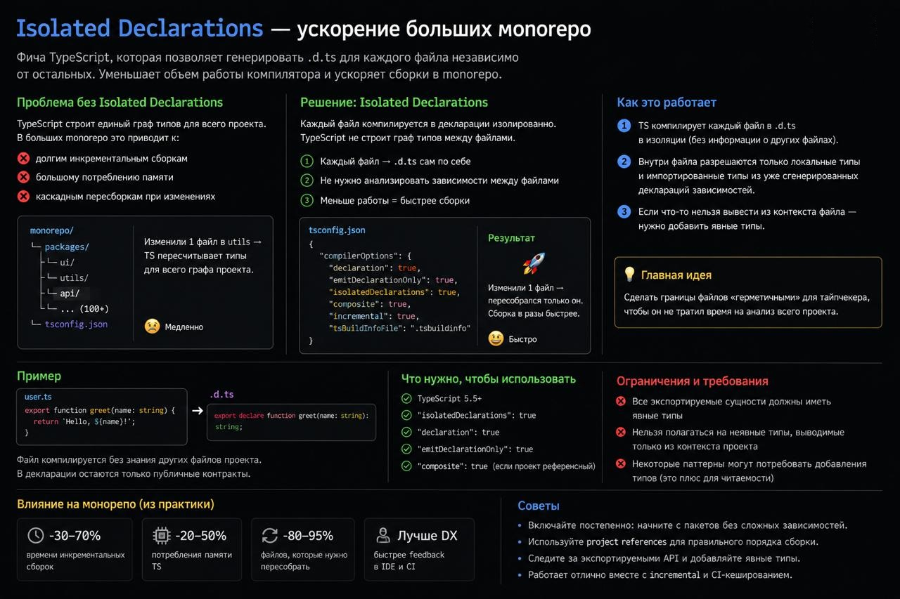
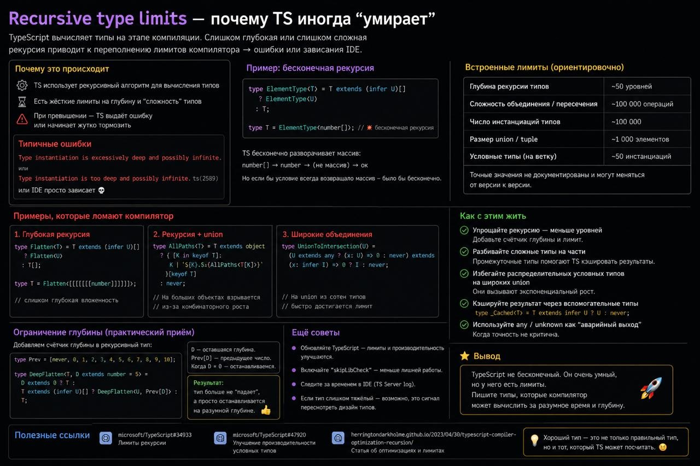
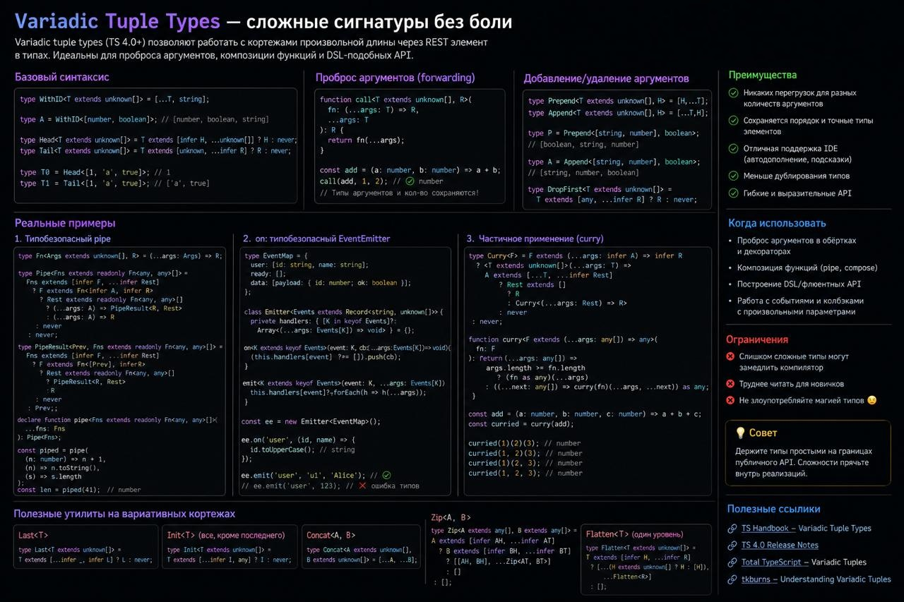

# Содержание

1. [Isolated declarations](#isolated-declarations)
2. [Recursive type limits](#recursive-type-limits)
3. [⁣Variadic tuple types](#variadic-tuple-types)

---

# ⁣Isolated declarations

**флаг isolatedDeclarations.**

В больших monorepo генерация .d.ts может становиться узким местом.

**isolatedDeclarations** заставляет писать код так, чтобы декларации можно было генерировать по файлам независимо. Из-за этого TypeScript чаще требует явные типы.

Это особенно полезно:

👉 большие monorepo  
👉 библиотеки  
👉 project references  
👉 параллельная сборка  
👉 CI, где каждая минута стоит денег

# Recursive type limits

Если тип разворачивается слишком глубоко, компилятор упирается в лимиты.

**Особенно опасны:**

👉 рекурсивные mapped types  
👉 огромные union’ы  
👉 type-level parser’ы  
👉 deeply nested generics  
👉 utility types поверх utility types

# ⁣Variadic tuple types

До variadic tuple types многие сложные сигнатуры в TypeScript выглядели как наказание.

**Особенно:**

👉 curry  
👉 compose  
👉 middleware  
👉 typed event emitter  
👉 любые функции с «прокинь аргументы дальше»

